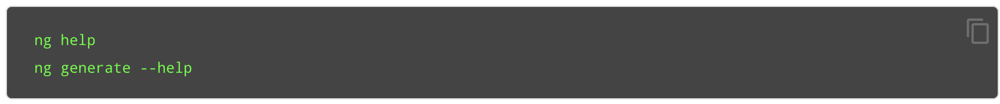

# Uso Angular CLI

Angular CLI es una herramienta de interfaz de línea de comandos que se usa para inicializar, desarrollar, andamiar \(scaffolding\) y mantener aplicaciones angular. Puede usar la herramienta directamente en un shell de comandos, o indirectamente a través de una interfaz de usuario interactiva, como Angular Console.

El angular CLI se instala a través del gestor de paquete de node **npm**.

Para obtener ayuda mediante el CLI

Para crear, construir y servir un nuevo proyecto angular básico en un servidor de desarrollo, _ve_ al directorio principal de tu nuevo espacio de trabajo y utiliza los siguiente comandos:

